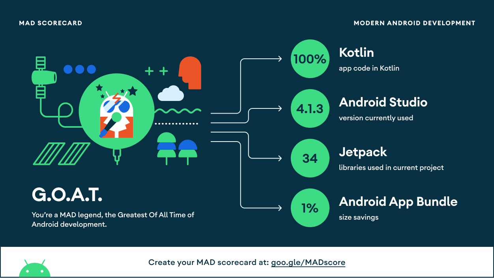

# Rick And Morty Android application

Application to test the Rick&Morty API, and test different libraries like the Jetpack Component suite.

## Screens 📱
The app currently consists of 3 screens:
- A list of characters screen, in which once the user enters de app, they can visualize a list of Rick&Morty characters taken from the API, and select one.
- A character detail screen, in which after selecting one character from the list, the user can visualize detailed information from said character, like their name, genre, and their last known location.
- A list of favorite characters screen.
- Dark and Light themes 

## MAD ScoreCard 👾
[Link to MAD Scoreboard](https://madscorecard.withgoogle.com/scorecard/share/2419017679/)

## Libraries 🛠️
- [Flow](https://developer.android.com/kotlin/flow)
- [Dagger Hilt](https://dagger.dev/hilt/)
- [Coil](https://coil-kt.github.io/coil/)
- [Android Jetpack](https://developer.android.com/jetpack)
  - [Navigator](https://developer.android.com/guide/navigation/navigation-getting-started)
  - [Livedata](https://developer.android.com/topic/libraries/architecture/livedata)
  - [View Binding](https://developer.android.com/topic/libraries/view-binding)
  - [Viewmodel](https://developer.android.com/topic/libraries/architecture/viewmodel)
  - [Lifecycle](https://developer.android.com/topic/libraries/architecture/lifecycle)
  - [Room](https://developer.android.com/training/data-storage/room)
- [Retrofit](https://square.github.io/retrofit/)
- [Moshi](https://github.com/square/moshi)

## Structure 🎨
- __App__:
  - __DI__: the dependency injector package, where the modules and components are created.
  - __UI__: with an MVVM pattern, everything is separated as features, the screens and logic behind them are found here.
  - __Utils__: A variety of classes, extensions, and helpers to help and use across the application, that not necessarily have anything to do with the logic of the same.   
  - __Framework__: Contains the dataSource implementations with your mappers.
- __Data__: Contains the repositories Implementations and one or multiple Data Sources.
  - __DataSource__: In which we have the source of the data we are going to work with, let it be the API abstraction, and/or the database.
   - __Repositories__: Repositories are responsible to coordinate data from the different Data Sources. A sort of abstraction for the data sources in order to avoid working directly with them. We make calls to them and we can ignore whether the data comes from the network or a local database.
- __Domain__: Collection of entity objects and related business logic that is designed to represent the enterprise business model.
  - __Models__: an abstraction of the objects that represent the logic of the project.
- __TestShared__: Collection of utilities to use in all the tests across the project.

## CI 🧬
- [GitHub Actions](https://github.com/features/actions)
- Automatic PR verification including tests, linters
- All script are located in [.github/workflows](.github/workflows) folder.

#### PR Verification

Series of workflows runs (in parallel) for every PR to `main` branch:
* `./gradlew lint` - runs Android lint - required to merge PR
* `./gradlew detekt` - runs detekt - required to merge PR
* `./gradlew ktlintCheck` - runs ktlint - optional to merge PR
* `./gradlew test` - run unit tests - required to merge PR
* `./gradlew connectedAndroidTest` - run UI tests - required to merge PR

## Testing 🧪
- [JUnit](https://junit.org/junit4/)
- [Mockk](https://mockk.io/)
- [Kluent](https://markusamshove.github.io/Kluent/)
- [Espresso](https://developer.android.com/training/testing/espresso)

